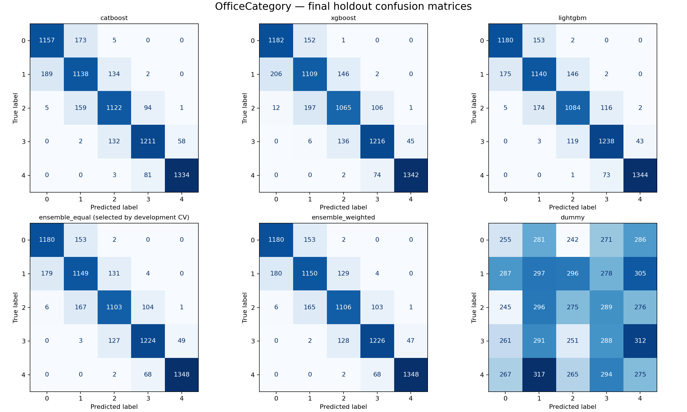

# Office building category classification

Reproducible comparison of CatBoost, XGBoost, LightGBM and probability-voting ensembles for the five labels of `OfficeCategory` (0–4). This repaired pipeline supersedes the historical notebook evaluation.

## Verified data

`office_train.csv`: 35,000 rows × 80 columns (79 predictors plus target). `office_test.csv`: 15,000 rows × 79 predictors, without labels or a source ID. Class counts: {'0': 6675, '1': 7314, '2': 6906, '3': 7013, '4': 7092}. The classes are approximately balanced, not exactly equal. The repository does not independently establish the provenance or meaning of each quality tier.

## Repaired evaluation

Raw labeled rows are split first, stratified 80/20 with seed 42: 28,000 development and 7,000 final holdout. Stratified five-fold CV runs only on development. Every fold creates fresh model/preprocessing pipelines. The same folds are used for every candidate and a stratified DummyClassifier baseline.

All 79 raw predictors are retained. Ten deterministic row-local features describe quality × office space, space/plot, space/restroom, space/meeting room, total area, office share, basement share, construction age, renovation age and recent renovation. Dates use YearListed. Undefined ratios/overflows become missing; finite numbers are capped at ±1e15 before fitting. This yields 89 predictors: 46 numeric and 43 categorical. No feature search or feature-effect claims are made.

CatBoost receives native categorical strings (including unseen categories), a distinct missing category token, and numeric medians fitted on its training partition. Its internal categorical statistics see only training labels. XGBoost and LightGBM use training-fitted numeric median imputation and OneHotEncoder(handle_unknown='ignore'); missing categories have a distinct token. All-missing numeric columns fall back to zero. No external target encoding or scaling is used. Literal `NA` strings are retained as categories; empty CSV fields are missing. `clean.csv` is never read.

Prospective independent iteration budgets are CatBoost 300 (depth 6, learning rate .08), XGBoost 240 (depth 5, rate .06), and LightGBM 320 (31 leaves, rate .04). There is no early stopping, parameter search or use of holdout results to choose counts. These are defensible fixed baselines, not claimed optima. Full parameters and one-thread CPU settings are in `office_ml/config.py` and the saved protocol. `--workers` schedules independent folds/refits in separate processes; the default is one. This run used 5 workers. Serial and parallel smoke predictions were verified identical.

Class probabilities are aligned to [0,1,2,3,4]. The historical weighted hypothesis uses `(1.2*p_catboost + p_xgboost + p_lightgbm)/3.2`: 37.5%, 31.25%, 31.25%. Equal voting uses one third each. Prediction is argmax of the averaged probabilities. Voting does not pick a different best model at each batch or iteration. Only these two weight sets are compared using development OOF predictions.

All decisions are persisted in `frozen_selection.json` before each candidate is fitted on complete development and scored once on the holdout. The selected candidate is then refitted on all labeled rows for submission, even if another candidate has higher holdout accuracy.

## Results

Generated from `artifacts/metrics.json` and `submission_metadata.json`.

Selected model: **ensemble_equal**, using highest development OOF accuracy, then macro F1, then candidate order.

| Model | CV accuracy ± SD | CV macro F1 ± SD | CV balanced accuracy ± SD | Holdout accuracy | Holdout macro F1 | Holdout balanced accuracy |
|---|---:|---:|---:|---:|---:|---:|
| catboost | 84.43% ± 0.75 | 84.53% ± 0.76 | 84.47% ± 0.75 | 85.17% | 85.24% | 85.22% |
| xgboost | 83.81% ± 0.76 | 83.89% ± 0.78 | 83.87% ± 0.76 | 84.49% | 84.54% | 84.55% |
| lightgbm | 84.71% ± 0.85 | 84.80% ± 0.86 | 84.75% ± 0.85 | 85.51% | 85.56% | 85.57% |
| **ensemble_equal (selected)** | 85.08% ± 0.77 | 85.17% ± 0.78 | 85.12% ± 0.77 | 85.77% | 85.82% | 85.82% |
| ensemble_weighted | 85.06% ± 0.77 | 85.15% ± 0.78 | 85.10% ± 0.77 | 85.86% | 85.91% | 85.91% |
| dummy | 19.93% ± 0.72 | 19.90% ± 0.72 | 19.90% ± 0.72 | 19.86% | 19.85% | 19.85% |

CV values summarize five development folds; SD is the sample standard deviation (ddof=1), in percentage points, not a confidence interval. OOF selection scores use all development predictions together. Holdout values are separate, after selection was frozen.

Development OOF: strongest ensemble `ensemble_equal` minus strongest single `lightgbm` = +0.375 percentage points. Holdout: strongest ensemble `ensemble_weighted` minus strongest single `lightgbm` = +0.343 percentage points. The ensemble beats the strongest single model on holdout accuracy. These are descriptive comparisons, not significance tests. The holdout does not change selection.


## Exact reproduction

Python 3.11 is tested. Create a virtual environment, install the locked packages, and run from this repository root. On macOS the boosting wheels may require an OpenMP runtime (`libomp`); see `VERIFICATION.md` for this machine's setup.

```bash
python3.11 -m venv .venv
source .venv/bin/activate
python -m pip install -r requirements-lock.txt
python -m pytest -q
python train_evaluate.py evaluate --smoke --output-dir artifacts-smoke
python train_evaluate.py evaluate --output-dir artifacts --workers 5
python train_evaluate.py submit --output-dir artifacts --id-template legacy/submission.csv --workers 5
python train_evaluate.py document --output-dir artifacts
python train_evaluate.py check --output-dir artifacts
```

Evaluation requires a new empty output directory so prior runs cannot be silently overwritten. If the delivered directories already exist, use new names consistently. A smoke run uses only a fixed 1,000-row development subset and two folds of eight iterations; it never scores the holdout and cannot generate a submission. Re-running full evaluation is reproduction of an already reported split, not a fresh independent test.

## Artifacts

`artifacts/metrics.json` includes all CV fold scores, holdout metrics, per-class precision/recall/F1/support, confusion matrices, timing and versions. `model_comparison.csv` contains the numeric comparison; `split_indices.npz`, `development_oof.npz` and `holdout_predictions.npz` make it auditable. The configuration and source/data hashes are recorded before holdout evaluation. `final_model.joblib` contains the fitted full-data winning pipelines; load only trusted local model files.



New predictions are `artifacts/submission.csv` (15,000 rows). Identifier provenance: existing repository submission template; official competition format unverified. The existing IDs are preserved in order, rather than silently recreated; the original submission is retained. No official competition template was supplied, so submission-format compliance is provisional. Unlabeled predictions supply no test accuracy evidence.

## Limitations and historical results

The holdout is isolated from all modeling decisions in this repaired execution. However, seed 42 reproduces the old notebook's validation row membership, and the entire dataset informed historical work. This is not a never-before-seen external evaluation. CV was used to choose among candidates and therefore has selection optimism. There is one holdout split, no uncertainty/significance analysis, no labeled external test set and no group/time-aware split. Scores describe these supplied rows; entity independence and deployment generalization are unverified.

The old 86.37% validation claim, 84.5% test claim, claimed improvements, feature rankings, cleaning counts and previous winner claims are not carried forward as evidence. See `LEGACY_RESULTS.md`. The notebook, report, ZIP, `clean.csv`, old submission and CatBoost logs are preserved as historical material; use `train_evaluate.py` to reproduce the repair.

## Team and attribution

The historical README names Shakhnazar Sailaukan (sailaukan), Nurtore Arynuruly (lourinser), and Ivan Kanev (vizior). It does not establish individual implementation boundaries. This repair was prepared with Codex at Nurtore's request; it does not establish that Nurtore alone authored the original models or teammates' work.
